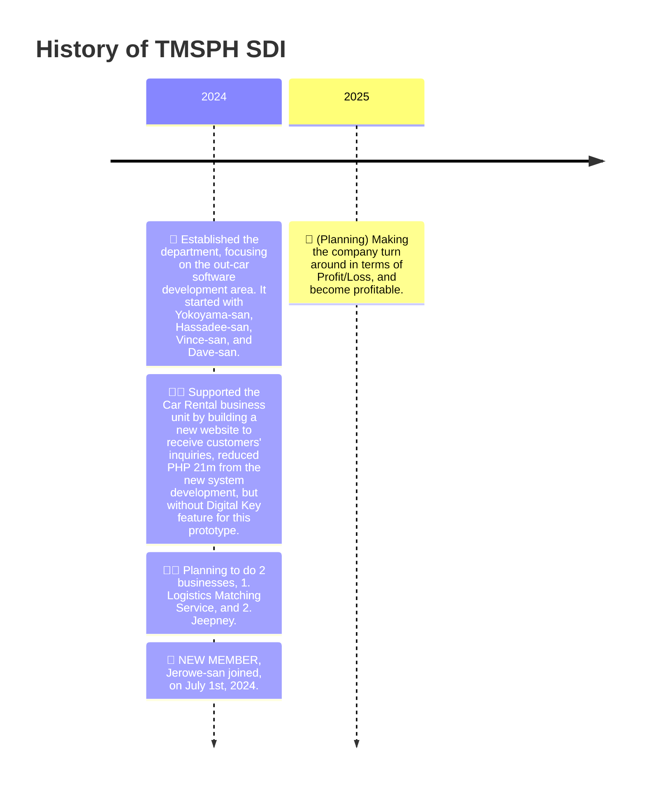

## Welcome to Toyota Mobility Solutions Philippines, Department of Software Development and Integration 👋

```mermaid
timeline
    title History of TMSPH SDI
    2024 : 🌈 Established the department, focusing on the out-car software development area. It started with Yokoyama-san, Hassadee-san, Vince-san, and Dave-san.
         : 👩‍💻 Supported the Car Rental business unit by building a new website to receive customers' inquiries, reduced PHP 21m from the new system development, but without Digital Key feature for this prototype.
         : 👩‍💻 Planning to do 2 businesses, 1. Logistics Matching Service, and 2. Jeepney.
         : 🧙 NEW MEMBER, Jerowe-san joined, on July 1st, 2024.
    2025 : 🌈 (Planning) Making the company turn around in terms of Profit/Loss, and become profitable.
```
